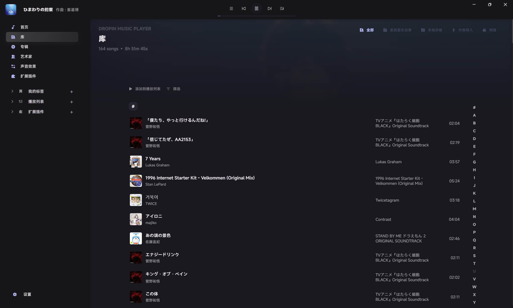
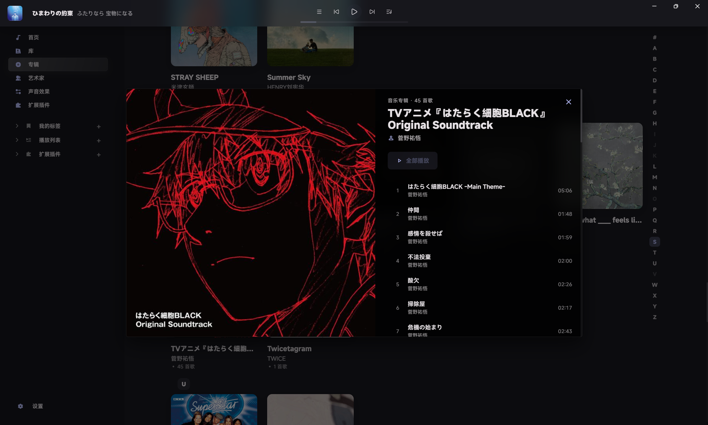
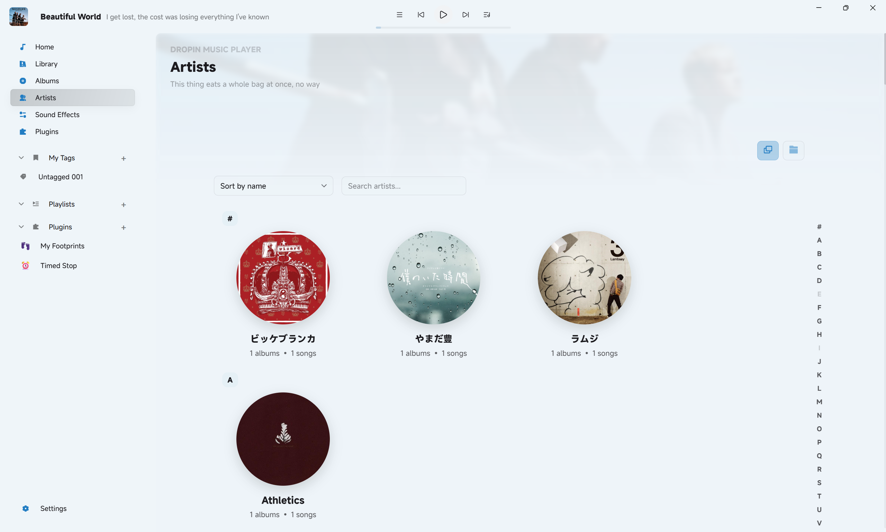

  <strong>简体中文</strong> | <a href="./docs/README_EN.md">English</a>

# Dropin

  

基于 `Tauri2.0` + `Vue3` + `BASS` 构建的音乐播放器, 适用于桌面端应用, 缓速更新中……

Dropin 以开放的态度开发, 欢迎提交 PR 以及相关探索. 感谢支持.

> [!warning]
>
> **此软件仅供学习交流使用, 严禁用于商业用途. 出现的任何后果作者概不负责!**

## 🚀 功能

- [x] 本地音乐库: 导入音乐文件夹, 自动扫描曲目 / 专辑 / 艺术家, 支持封面提取
- [x] 播放: 顺序 / 随机 / 单曲循环, 列表循环, 播放进度记忆
- [x] 歌词: 读取本地歌词文件, 全屏歌词显示
- [x] Windows 系统集成: SMTC 媒体控制 (系统媒体键 / 音量面板)
- [x] 主题: 跟随系统深浅色, 专辑封面自动取色
- [x] 多语言支持.
- [ ] 音效设置
- [ ] 插件系统

等等, 一个个来吧!

## 🐛 尝鲜与调试

确保已安装 Rust 工具链与 [Tauri 前置依赖](https://tauri.app/start/prerequisites/).

安装依赖: `pnpm install`

运行 Dev 版: `pnpm tauri dev`

构建发布版: `pnpm tauri build`

## 📷 运行截图

